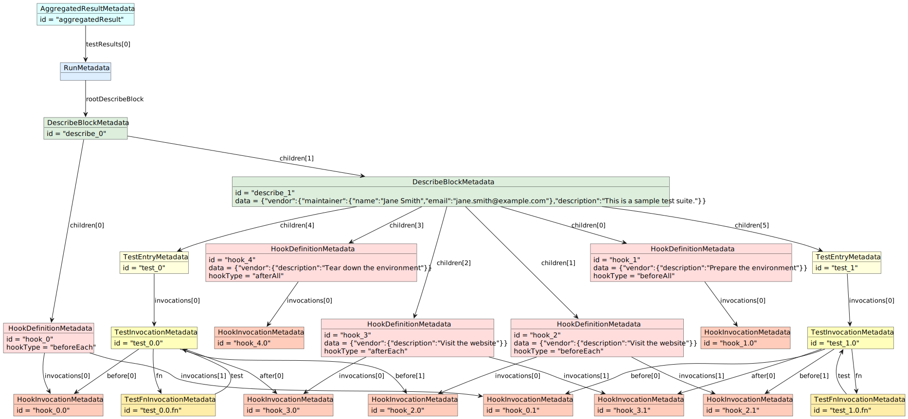

# Metadata targets

* Aggregated result (global metadata)
  * Test file run
* Definitions:
  * `describe` blocks
  * `beforeAll` and `afterAll` hooks
  * `beforeEach` and `afterEach` hooks
  * `it/test` entries
* Invocations:
  * `describe` blocks (when running)
    * `beforeAll` hook invocations
    * `it/test` invocations
      * `beforeEach` hook invocations
      * `it/test` function invocations
      * `afterEach` hook invocations
    * `afterAll` hook invocations

## Example suite

```js
const { $Set, $Push } = require('jest-metadata');

const $Description = (text) => $Set('vendor.description', text);
const $Maintainer = (name, email) => $Set('vendor.maintainer', { name, email });
const $Step = (text) => $Push('vendor.steps', { text, startedAt: now });
const $Label = (value) => $Push(['vendor', 'labels'], value);
const $Flaky = () => $Label('flaky');

const actions = require('./actions');

$Maintainer('Jane Smith', 'jane.smith@example.com');
$Description('This is a sample test suite.');
describe('Login flow', () => {
  $Description('Prepare the environment');
  beforeAll(() => {
    $Step('Open the browser');
    actions.openBrowser();
  });

  $Description('Visit the website');
  beforeEach(() => {
    $Step('Goto the URL: https://example.com');
    actions.goto('https://example.com');
  });

  $Description('Visit the website');
  afterEach(() => {
    $Step('Clear cookies');
    actions.clearCookies();
  });

  $Description('Tear down the environment');
  afterAll(() => {
    $Step('Close the browser');
    actions.closeBrowser();
  });

  $Label('sanity');
  test('Unhappy scenario', () => {
    $Step('Enter invalid credentials');
    actions.sleep(100);
    $Step('Assert that the login failed');
  });

  $Flaky();
  $Label('sanity');
  test('Happy scenario', () => {
    $Step('Enter valid credentials');
    actions.sleep(100);
    $Step('Assert that the login succeeded');
  });
});
```

## Example diagram




